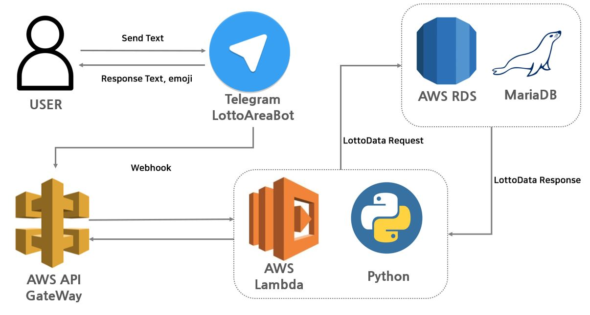

## LottoWinningAreaBot

**텔레그램을 통해 "지역" 입력 -> 해당 지역의 1등, 2등을 합산하여 상위 5군데의 판매점 정보를 제공하는 사이드 프로젝트**
___

## 개발환경
- Cloud Service : AWS Lambda
- DataBase : AWS RDS(MariaDB) 
- Language : Python3.6 또는 3.7
- IDE : Pycharm
- library : botcore.vendored, BeautifulSoup, pymysql
___

## 사전 작업
- pip install [library] 또는 pycharm -> Settings -> Project Interpreter을 통해 library 설치
- AWS Lambda에서 Python library사용을 위한 layer 구성
- Telegram Bot 및 webhook 설정
___

## 개발 인프라
- **로또 판매점 정보 가져오기 내역 구성**

___

- **로또 판매점 정보 주고받기 내역 구성**

___

## 구현 내역
- 로또 지역이 존재하는 경우에는 해당 지역의 상위 내역을 표시
- 로또 지역이 존재하지 않은 경우 즉 미 존재인 경우에는 메시지 표시

